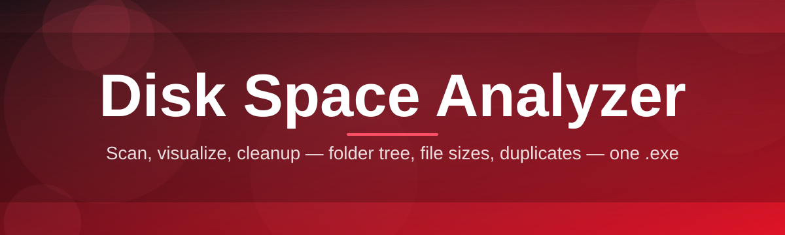

# disk-space-optimizer

Scan, visualize, cleanup — folder tree, file sizes, duplicates — one .exe

  

## Overview

Scan, visualize, cleanup — folder tree, file sizes, duplicates — one .exe

## License

[MIT License](LICENSE)
